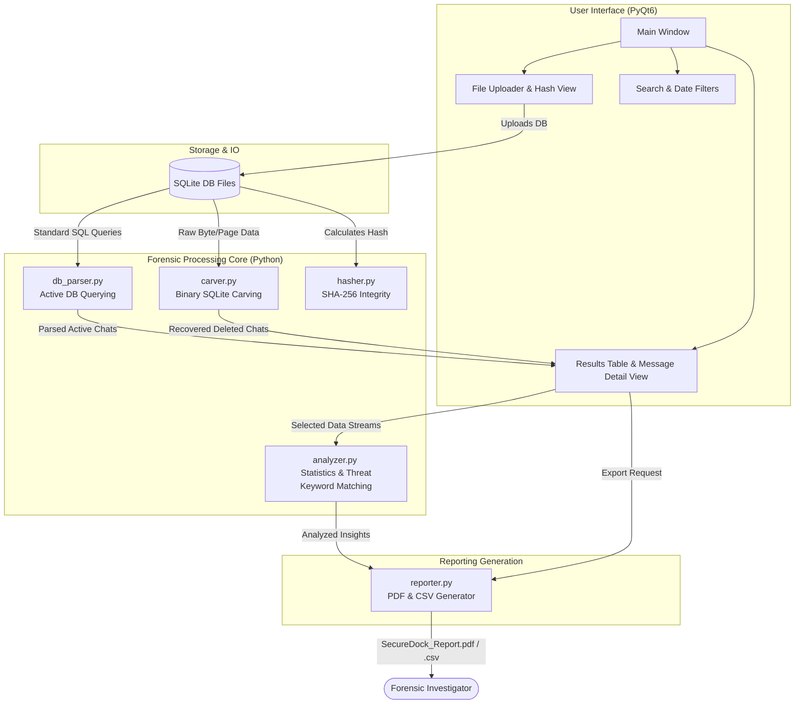

# TAE-1 TOPIC: A Forensic Analysis Tool for Deleted Chat Conversations
**GitHub Repository URL:** [https://github.com/Sarvesh2005-code/securedock](https://github.com/Sarvesh2005-code/securedock)

---

## 1. ABSTRACT
The rapid proliferation of instant messaging applications has centralized highly sensitive and critical data on mobile and desktop devices. Unfortunately, malicious actors or subjects of an investigation often attempt to cover their tracks by deleting chat conversations. "SecureDock" is a specialized, lightweight, desktop-based forensic analysis tool designed explicitly for the recovery, analysis, and secure reporting of deleted and intact chat conversations from compromised or seized devices. 

By directly parsing raw SQLite database files—such as those used by widely adopted messaging platforms (e.g., WhatsApp, Telegram, Google Messages)—SecureDock goes beyond simple querying. It leverages advanced byte-level database carving techniques to retrieve "freelist" pages and unallocated spaces where deleted messages reside before being overwritten. Furthermore, SecureDock integrates rigorous cryptographic hashing mechanisms to guarantee the chain of custody and data integrity. The intuitive graphical interface allows forensic investigators to filter by date ranges, search with keywords, and rapidly generate verifiable, court-ready PDF and CSV reports.

## 2. INTRODUCTION
Digital forensics faces a constant challenge: extracting meaningful evidence while maintaining rigorous legal standards of data integrity. In many investigations, chat logs are paramount. However, when a user deletes a message within a standard chat application, the underlying database (typically SQLite) does not immediately erase the data from the disk. Instead, the data layer marks those memory blocks as available or "free."

SecureDock is developed to empower forensic analysts with an automated, robust, and user-friendly platform to extract both active and recoverable deleted records. 

**Key Objectives of SecureDock:**
- **Automated SQLite Parsing:** Seamlessly connect and extract active records from varying chat database schemas.
- **Data Carving:** Implement low-level binary carving to resurrect deleted chat records from SQLite memory structures.
- **Cryptographic Integrity:** Hash all imported databases and generated reports (SHA-256) to maintain a pristine chain of custody.
- **Professional Reporting:** Export findings into visually comprehensive PDF and structured CSV formats for judicial or investigative reviews.

## 3. PROJECT ARCHITECTURE DIAGRAM
The architecture of SecureDock is highly modular, ensuring a clean separation of concerns among the graphical user interface, the core forensic processing engine, and the reporting mechanisms.

*Below is the Mermaid.js representation of the Application Architecture (can be directly visualized in Draw.io or NotebookLM as requested).*

## 4. TECHNOLOGY STACK
The technology stack for SecureDock is focused on high-performance local processing, robust UI development, and zero-dependency standalone execution capable of securely parsing sensitive files.

### **Front-End (Graphical User Interface)**
*   **Framework:** `PyQt6` (Python bindings for the Qt v6 cross-platform application framework).
*   **Design Paradigm:** Event-driven architecture utilizing professional light/dark native themes, QTableWidgets for layout rendering, and distinct layout structures tailored for forensic analysis.

### **Back-End (Core Logic & Parsing Engine)**
*   **Language:** `Python 3.10+`
*   **Binary Processing:** Native Python `struct` and byte-array parsing for deep-level SQLite block carving without relying on external decompilers.
*   **Security & Hashing:** Python native `hashlib` (SHA-256) and `hmac` algorithms to guarantee document and database integrity post-seizure.

### **Database (Target Parsers)**
*   **Core Extraction Target:** `SQLite3` standalone database structures.
*   **Modules Used:** Standard library `sqlite3` driver customized to handle highly malformed schemas typical in data-carving scenarios.

### **APIs & Key Libraries**
*   **PDF Generation:** `reportlab` (Version 4.3.0) - A robust library used for dynamic document generation, generating the court-ready PDF architectures.
*   **Data Export API:** Python native `csv` library for standardized structured analysis outputs.
*   **Platform API:** `sys` and `os` native modules to ensure cross-platform pathing and memory execution between Windows, macOS, and Linux forensics environments.
